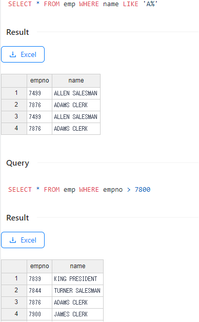
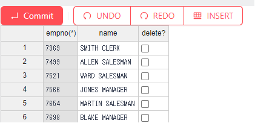
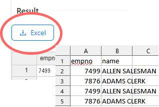

# sqlitegns

Sqlitegns is a tool for full client-side manipulation of SQLite databases.

# Feature

- run multiple SQL queries against a database and display each query results in a separate table.

- Edit database tables in an EXCEL-like editor.

- Export result sets to EXCEL files.

# Quick Start

You can use the latest release of sqlitegns from [https://gearsns.github.io/sqlitegns/index.html](https://gearsns.github.io/sqlitegns/index.html).

# Components

[Ant Design](https://ant.design)
[dexie](https://dexie.org)
[exceljs](https://github.com/exceljs/exceljs)
[handsontable 6.2.2](https://github.com/handsontable/handsontable)
[highlight.js](https://highlightjs.org)
[m-react-splitters](https://www.npmjs.com/package/m-react-splitters)
[monaco-editor](https://github.com/microsoft/monaco-editor)
[sql.js](https://github.com/sql-js/sql.js/)
